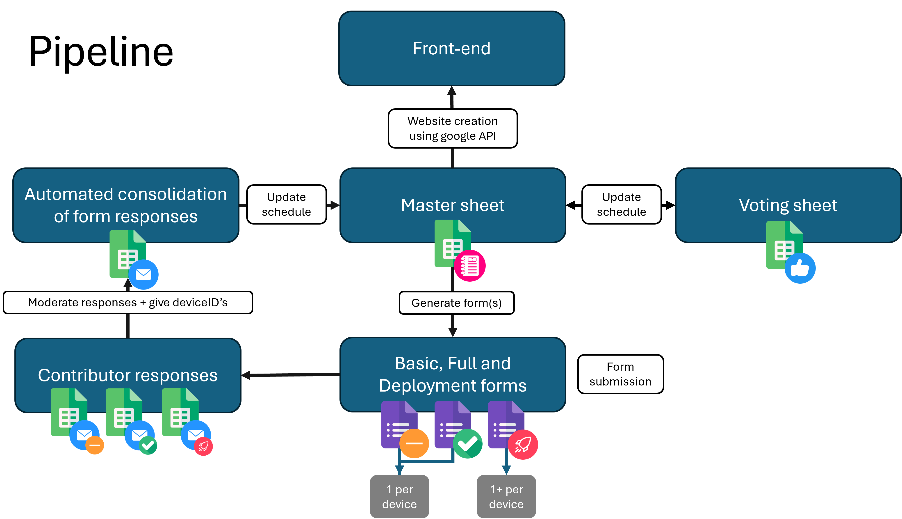

⚠ Luca: I used this branch to modify the code run locally on my machine, as wella s using Google Sheets and Forms that I owned, to test transferability.  No further fetaure development beyond should be pushed here. ⚠

# Redesigning approach dev notes

The general idea is to implement this workflow: 
```
DATABASE STRUCTURE JSON --- createForms.py ---> FULL FORM
FULL FORM --- collectResponses.py ---> responses (JSON, CSV)
```

Re-implementation TODO list: 
- [x] Proof of concept JSON to Google Form
- [ ] Transfer over actual questions into JSON format: 
    - [ ] Basic form: [Form link](https://docs.google.com/forms/d/1mXaEkw1lydgeE5Ld0X5j2Xp82ABDgnQeQ79CvEJi_UQ/edit) or in `json_body.json` + `json_form.json` if generated from that. 
    - [ ] Full form: [Form link](https://docs.google.com/forms/d/1k7RsEdOJrLW6ZDwOTHNdgDH2VSYWETfCI-1HyznB0m8/edit) or in `json_body.json` + `json_form.json` if generated from that. 
- [ ] Implement collecting answers and parsing into human-readable JSON
    - [ ] how to track response spreadsheet when form is re-generated at every JSON update?
    - [ ] what about attached pictures?
- [ ] Change from OAuth token-based authentication to service account-based authentication (i.e. like for ACCESS website)
- [ ] Develop CI/CD workflow on Github
*Extras*
- [ ] Will need to come up with a sensible versioning/tagging system for JSON database ontology 
- [ ] Make basic frontend for visualising answers (static website w/ GitHub pages?)

## Proof of concept
Proof of concept with `createForm.py` and JSON-based questions successful. We can even do simple logic navigation within the form. 

The way this works currently is that it creates a new form with every rerun; *does not* append questions to existing form. The idea is that we could trigger re-building of the form upon changes to the underlying JSON ontology. For that, will need to implement a versioning or tagging system to keep track of which form is generated from which ontology. 

## Migrating to JSON-based schema
I figures it would be easier to start from the full form and modify its structure to produce JSON for the database schema. 

`extractingQuestions_temp.py` grabs the info from the existing full form, and additionally removes unnecessary info like questionsId and similar (fun `sanitise_form`), since they will be lost anyway during form creation. 
Also added section and questions syntax to improves readability and facilitates modification down the line. These map to Google Forms API's terms like so: 

| JSON schema    | Google Forms API   |
| -------------- | ------------------ |
| `form.title`   | `info.title`       |
| `sections[]`   | `pageBreakItem`    |
| `questions[]`  | `questionItem`     |
| Question order | insertion order    |
| Section order  | insertion order    |
| Symbolic `id`  | not sent to Google |

Importantly, the `id` field is what I will use to collect the answers, as a shorthand for the question. It needs to be unique. 

The order the questions will appear in the form is determined by their order within the JSON, nested within `section[]`. 

The general syntax is as follows: 
 - There's an `info` block, that contains general details for form. 
 - This is followed by `settings`, currently only manages whether sign-in is required. 
 - Then there's the `section` block, that takes a unique `id` and other details
 - Nested within `section`, there's `questions`, that itself takes a unique `id` and the question, its description and type as well as allowed options (for some types). 

Within-block syntax follows quite closely Google Forms API's syntax. 
Example JSON schema below:
```json
{
  "info": {
    "title": "The form title here (not the file name)",
    "description": "You description here."
  },
  "settings": {
    "emailCollectionType": "DO_NOT_COLLECT"
  },
  "sections": [
    {
      "id": "sec1",
      "title": "Section 1",
      "description": null,
      "questions": [
        {
          "id": "q1",
          "title": "Question 1",
          "required": true,
          "type": "choice",
          "choiceType": "RADIO",
          "options": [
            "Yes",
            "No"
          ]
        },
        {
          "id": "q2",
          "title": "Question 2",
          "required": true,
          "type": "text",
          "paragraph": false
        }
      ]
    },
    {
      "id": "sec2",
      "title": "Section 2",
      "description": "Your section description here.",
      "questions": [
        {
          "id": "q3",
          "title": "Question 3",
          "required": true,
          "type": "text",
          "paragraph": false
        }
      ]
    }
}
```
Trying to add logic handling from the JSON schema, using unique `id`s as anchors. 

Adding `logic` block to JSON, *only choice questions supported*, that has a `got_to` key that maps to API actions: 

| Value          | API equivalent                        | Meaning              |
| -------------- | ------------------------------------- | -------------------- |
| `"section_id"` | `goToSectionId: "<pageBreak itemId>"` | Jump to that section |
| `"next"`       | `goToAction: "NEXT_SECTION"`          | Go to next section   |
| `"submit"`     | `goToAction: "SUBMIT_FORM"`           | Submit form          |

Now testing new parser... 


> [!TIP]
> Don't forget to look at https://github.com/rhine3/bioacoustics-software for inspiration about the workflow!

<details>   <!-- this is to begin the "spoiler section" -->
  <summary><h2>Original README contents</h2></summary>

# [OLD] Insect AI Hardware Database

<p align="center">

</p>

## Data submission pipeline for documenting of Insect AI hardware

This repository contains the following:
- Link to a Google Master spreadsheet - the schema defining accepted fields, validation criteria and metadata for Google form generation.
- Link to the most up-to-date Google form(s) - the method of data input by contributors to the database entries
- Script for generating Google forms from the Master spreadsheet
- Table showcasing basic details of hardware submitted by contributors so far

## Introduction

### Scope

#### Script

`debugScript.py` is a Python script which converts the Master google spreadsheet of hardware (the ground truth for the database) into a JSON file which in turn is used to produce a google form. The generated Google Form requests details from hardware developers, modifiers and users and is the entry point for submission to the hardware database. Google sheet and Google form handling is achieved through their respective Google API's which are called in the script. Currently when running the script for the first time you will be prompted to log in to a google account to generate a token that will allow usage of the API's.

#### Master spreadsheet

This is the [Master Sheet](https://docs.google.com/spreadsheets/d/1DClwffVrkrwH0G5nuCVCJVVoLLdueuqHdJ_VXWPc_Pg/edit?gid=0#gid=0) that contains the form generation metadata. 

#### Submission forms

This is the [Full Form](https://docs.google.com/forms/d/19htB7BIDoh3ngRtvgURIyCrT1Cir_ScP4lWVnZ-ftHc/edit) for detailed entry submission.

</details>   <!-- this is to end the "spoiler section" -->

> [!CAUTION]
> If, when running any of the scripts, you get an error like: 
>``` python
>google.auth.exceptions.RefreshError: ('invalid_grant: Bad Request', {'error': 'invalid_grant', 'error_description': 'Bad Request'})
>```
>It just means that the token is expired and re-authentication workflow is stuck. Simply remove the file `token.json` that gets saved in the same dir as the script and authenticate again. 

# ToDos
- [ ] Refactor big script into helper functions script, and various targeted script
    - [ ] Bonus: add argparse to add exports, dry run and verbosity levels. 
    - [x] move export into dedicated folder
- [ ] Add github pages automation
    - [ ] need to investigate the best way to store credentials
- [ ] Create (or do we have one already?)  InsectAI Gmail account that an own the various spreadsheets, forms and eventually GDrive with the uploaded pictures. 
- [ ] Restructure the README so that it has a quickstart section for contributors and link to the data at the top, explanation and maintenance notes after. 

*Only after discussing with Graham & others:*
- [ ] Change to new workflow with JSON-based database ontology that propagates in Google forms. 
- [ ] Prepare exports in an easily accessible format: one JSON file per device (+ picture) or one single CSV dump for all devices (+link to pics)?

<details>   <!-- this is to begin the "spoiler section" -->
  <summary><h2>Luca's dev notes</h2></summary>

### Authorising Google API and running locally

To test if the script compiles correctly, I need to authorise locally the script to access the Master Sheet and (?) the form. 

Making a copy into my own Google account (luca.pegoraro@wsl.ch) of the Master Sheet. 

The Google sheets ID and Google form ID are the alphanumeric string in the URL, just copy those. 

Getting the API token required for OAuth2 authentication. 
On the luca.pegoraro@wsl.ch Google account, enable the relevant APIs: Google Sheets, Google Forms and Google Drive. 
Then, create Oauth consent screen for your app (I called it "InsectAI hardware-db"). 

Under Google Auth Platform > Clients > Create client you can finally create the OAuth client ID that you need to authorize a desktop app to access private data in sheets, forms and so on. Here you can finally download the JSON file you need. 

*[credentials edited out for privacy]*

Can you rename the JSON you download? - Yep, sure looks like it. 

You also need to add Test users to the app if it's in testing mode. I've added myself and Graham's google accounts. 

Now running the authentication workflow (`debugScript.py:47-54`)  will open a webpage, and ask for authorization to access personal data from your google account. 

It writes a token.json file with the specified scopes. 

### What does what

`debugScript.py` for now contains everything, from form creation and update to exports. Will need to separate out in different scripts: 
 - helper functions related to Google API (maybe also config variables reading) 
 -  form creation and update (maybe both response and feedback form together)
 -  reading and exporting from responses 

`oauth_client-WSL_laptop.json` contains the credentials for the google API, these are used to request or refresh the token that allows time-limited access to the data. 

`token.json` this is the token that gets refreshed every time you request data. 

`json_body.json`, `json_existing.json`, `json_form.json` and `json_info.json` are all exports of the script that contain almost the same information, namely the form headings, questions and allowed answers. Maybe they serve some purpose for debugging but will need to consolidate them. 

`form_responses.csv` and `form_responses.json` are new exports I made that grab the responses to the form and save them. They still have questions IDs and not the actual text of the question. 

## New workflow idea

After delving into the nuts and bolts of the current workflow, I think I have another idea of how to manage it. 

The current workflow is: 
```
MASTER SPREADHSEET --- debugScript.py ---> FULL FORM
FULL FORM --- debugScript.py ---> JSON exports
FULL FORM --- debugScript.py (added funs) ---> responses (JSON & CSV)
```

I feel like defining questions and values and all that in a spreadhseet is too brittle, and does not allow for easy tracking. Realistically, after the initial phase (i.e. now), the database structure will not need sweeping changes very frequently. 
I would much prefer to see a text based, versioned structure, that can be used to create the form. 

Below a revised workflow proposition: 
```
(NEW) DATABASE STRUCTURE JSON --- (NEW) createForms.py ---> FULL FORM, SIMPLE FORM
FULL FORM, SIMPLE FORM --- (NEW) collectResponses.py ---> responses (JSON, CSV)
```

When modification to the DB structure are needed, these can be made at the point DATABASE STRUCTURE JSON and propagate to the rest of the pipeline from there. 
The frontend can then be served using the CSV or JSON exports as data sources. 

</details>   <!-- this is to end the "spoiler section" -->